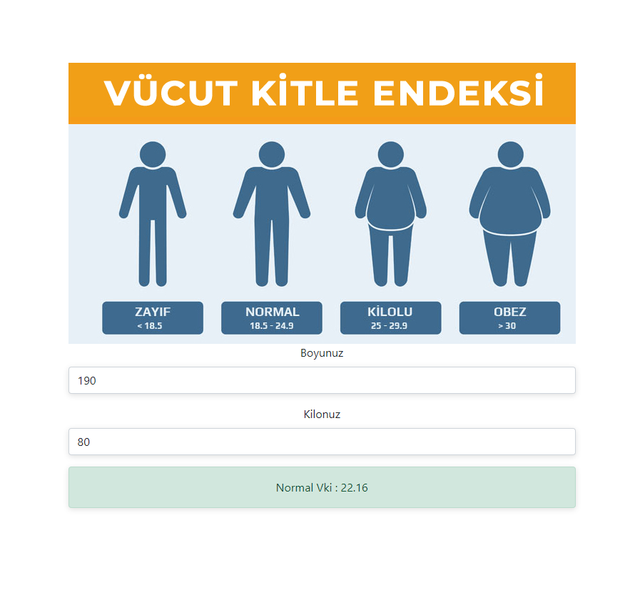

# Boy Kitle Endeksi

Merhabalar, Patika.dev'de gördüğümüz eğitimleri daha da ileriye taşıyabilmek adına projeler deniyorum ve en son yaptığım projem Vicut kitle endeks hesaplamasıdır. bu hesaplama içerisinde aşağıda yer alan diller kullanılmıştır.

## Ekran Görüntüsü

## Kullanılan Diller.

  
  
  
  